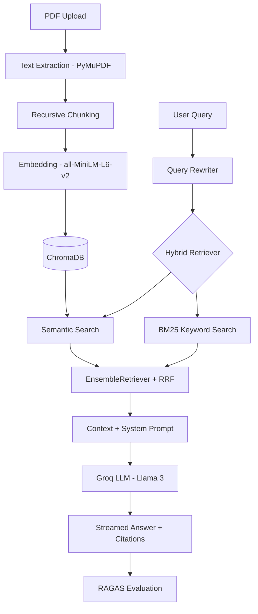

# 📄 RAG Document Assistant

A production-grade **Retrieval-Augmented Generation (RAG)** application that lets users upload PDF documents and ask natural language questions — with answers grounded **strictly** in the uploaded content. No hallucinations, no outside knowledge.


---

## 🏗️ Architecture

```
PDF Upload → Text Extraction → Chunking (Recursive, Overlapping)
     → Embedding (all-MiniLM-L6-v2) → ChromaDB Vector Store
     → User Query → Query Rewriting → Hybrid Retrieval (Semantic + BM25)
     → Context Assembly → LLM Generation (Groq/Llama 3) → Streamed Answer + Sources
```



---

## ✨ Features

### Core
- **📤 Multi-PDF Upload** — Upload one or many PDFs simultaneously
- **🔍 Hybrid Retrieval** — Semantic search (ChromaDB) + Keyword search (BM25) via EnsembleRetriever
- **🤖 Grounded Generation** — Llama 3 via Groq with strict system prompts — zero hallucinations
- **📚 Source Citations** — Every answer includes file name, page number, and relevant chunk snippets
- **⚡ Streaming Responses** — Token-by-token streaming for responsive UX

### Advanced
- **💬 Conversational Memory** — Follow-up questions with context-aware query rewriting
- **🔄 Query Rewriting** — Vague questions are reformulated for better retrieval
- **📊 RAGAS Evaluation** — Measure Faithfulness, Answer Relevancy, and Context Precision
- **📈 Score Tracking** — Historical evaluation scores plotted over queries
- **🗑️ Document Management** — Delete individual PDFs or clear all, with automatic re-indexing
- **⚙️ Live Settings** — Adjust Top-K, chunk size, hybrid weights at runtime
- **🎨 Professional Dark UI** — Custom-styled Streamlit with Inter font, gradients, and animations

### Hallucination Prevention
- Strict system prompt constraining answers to retrieved context only
- If context is insufficient, the model responds: *"The answer was not found in the uploaded documents."*
- Low LLM temperature (0.1) for factual consistency

---

## 🛠️ Tech Stack

| Component | Technology |
|---|---|
| **Frontend** | Streamlit (dark theme, custom CSS) |
| **Backend** | Python 3.10+ |
| **Orchestration** | LangChain 0.2+ |
| **LLM** | Groq API — Llama 3.3 70B Versatile |
| **Embeddings** | sentence-transformers/all-MiniLM-L6-v2 (384-dim) |
| **Vector Store** | ChromaDB (persistent local storage) |
| **PDF Parsing** | PyMuPDF (fitz) |
| **Hybrid Search** | BM25Retriever + EnsembleRetriever |
| **Evaluation** | RAGAS (Faithfulness, Relevancy, Precision) |

---

## 📂 Project Structure

```
RAG Project/
├── app.py                      # Main Streamlit entry point
├── requirements.txt            # Python dependencies
├── .env.example                # Environment variable template
├── .streamlit/
│   └── config.toml             # Dark theme configuration
│
├── config/
│   ├── __init__.py
│   └── settings.py             # Centralized configuration
│
├── loaders/
│   ├── __init__.py
│   └── pdf_loader.py           # PDF text extraction (PyMuPDF)
│
├── embeddings/
│   ├── __init__.py
│   └── embedding_manager.py    # HuggingFace embedding singleton
│
├── vectorstore/
│   ├── __init__.py
│   └── chroma_store.py         # ChromaDB CRUD operations
│
├── retriever/
│   ├── __init__.py
│   ├── hybrid_retriever.py     # Semantic + BM25 ensemble
│   └── query_rewriter.py       # LLM-based query reformulation
│
├── chains/
│   ├── __init__.py
│   └── rag_chain.py            # RAG pipeline (retrieval → generation)
│
├── evaluation/
│   ├── __init__.py
│   └── ragas_evaluator.py      # RAGAS metrics computation
│
├── ui/
│   ├── __init__.py
│   ├── sidebar.py              # PDF upload & document management
│   ├── chat.py                 # Chat interface with streaming
│   ├── sources.py              # Retrieved source viewer
│   └── metrics.py              # RAGAS evaluation display
│
├── utils/
│   ├── __init__.py
│   ├── logger.py               # Structured rotating logger
│   └── helpers.py              # Shared utility functions
│
├── data/
│   └── chroma_db/              # Persisted vector database
│
└── logs/
    └── rag_app.log             # Application logs
```

---

## 🚀 Prerequisites

- **Python 3.10+** — [Download](https://www.python.org/downloads/)
- **Groq API Key** (free tier) — [Get one here](https://console.groq.com)
- **Git** (optional) — For cloning the repository

### Hardware
- **RAM:** 4GB minimum (8GB recommended for large PDFs)
- **Disk:** ~500MB for the embedding model + vector store
- **GPU:** Not required (CPU-only by default)

---

## 📦 Installation & Setup

### 1. Clone / Navigate to the project

```bash
cd "RAG Project"
```

### 2. Create a virtual environment

```bash
python -m venv venv

# Windows
venv\Scripts\activate

# macOS/Linux
source venv/bin/activate
```

### 3. Install dependencies

```bash
pip install -r requirements.txt
```

### 4. Configure environment variables

```bash
# Copy the template
copy .env.example .env    # Windows
cp .env.example .env      # macOS/Linux

# Edit .env and add your Groq API key
GROQ_API_KEY=gsk_your_actual_key_here
```

### 5. Run the application

```bash
streamlit run app.py
```

The app will open at **http://localhost:8501**

---

## 📖 Usage Guide

### Uploading Documents
1. Open the **sidebar** (left panel)
2. Click **"Browse files"** or drag-and-drop PDFs
3. Click **"📥 Process & Index"** to extract, chunk, and embed
4. View indexed documents in the "Indexed Documents" section

### Asking Questions
1. Type your question in the chat input at the bottom
2. The system will:
   - Rewrite your query (if it's a follow-up)
   - Search for relevant chunks (hybrid: semantic + BM25)
   - Stream the answer with source citations
3. Expand **"📚 Sources"** below each answer to see retrieved chunks

### Evaluating Quality
1. After asking a question, go to the **📊 Evaluation** tab
2. Click **"🧪 Run RAGAS Evaluation"**
3. View scores for:
   - **Faithfulness** — Is the answer grounded in the context?
   - **Answer Relevancy** — Does the answer address the question?
   - **Context Precision** — Are the best chunks ranked first?

### Managing Documents
- **Delete individual PDFs:** Click the 🗑️ button next to a document
- **Clear all:** Click "🗑️ Clear All Documents"
- **Re-upload:** Upload updated versions of the same PDF

---

## ⚙️ Configuration

All settings are in [`config/settings.py`](config/settings.py):

| Setting | Default | Description |
|---|---|---|
| `LLM_MODEL` | `llama-3.3-70b-versatile` | Groq model name |
| `LLM_TEMPERATURE` | `0.1` | Lower = more factual |
| `EMBEDDING_MODEL` | `all-MiniLM-L6-v2` | HuggingFace model |
| `CHUNK_SIZE` | `1000` | Characters per chunk |
| `CHUNK_OVERLAP` | `200` | Overlap between chunks |
| `TOP_K` | `5` | Chunks to retrieve |
| `SEMANTIC_WEIGHT` | `0.7` | Weight for vector search |
| `BM25_WEIGHT` | `0.3` | Weight for keyword search |
| `ENABLE_HYBRID_SEARCH` | `True` | Toggle hybrid retrieval |
| `MEMORY_WINDOW_SIZE` | `10` | Chat history window |

---

## 🧪 Example Queries

After uploading a PDF (e.g., a research paper, textbook, or report):

| Query | Expected Behavior |
|---|---|
| *"What is the main conclusion of this paper?"* | Extracts and cites the conclusion section |
| *"Summarize the methodology used."* | Grounded summary from methods section |
| *"What were the results in Table 3?"* | Extracts data from the table's page |
| *"Tell me about quantum physics."* | Returns: "The answer was not found in the uploaded documents." |
| *"Can you elaborate on that?"* | Uses query rewriting to resolve "that" from history |

---

## 🔒 Hallucination Prevention

The system uses multiple layers to prevent fabrication:

1. **Strict System Prompt** — The LLM is instructed to only use provided context
2. **Low Temperature (0.1)** — Reduces creative/random outputs
3. **Source Grounding** — Every answer must reference source documents
4. **Fallback Response** — If context is insufficient: *"The answer was not found in the uploaded documents."*
5. **RAGAS Faithfulness Score** — Measures if the answer is actually grounded

---

## 📊 RAGAS Evaluation Metrics

| Metric | What It Measures | Good Score |
|---|---|---|
| **Faithfulness** | Is every claim in the answer supported by context? | > 0.8 |
| **Answer Relevancy** | Does the answer actually address the question? | > 0.8 |
| **Context Precision** | Are the most relevant chunks ranked first? | > 0.7 |

---

## 🚀 Deployment Guide

### Local (Default)
```bash
streamlit run app.py
```

### Docker (Optional)

```dockerfile
FROM python:3.11-slim

WORKDIR /app
COPY requirements.txt .
RUN pip install --no-cache-dir -r requirements.txt

COPY . .
EXPOSE 8501

CMD ["streamlit", "run", "app.py", "--server.port=8501", "--server.address=0.0.0.0"]
```

```bash
docker build -t rag-assistant .
docker run -p 8501:8501 --env-file .env rag-assistant
```

### Cloud Deployment
- **Streamlit Cloud:** Push to GitHub → connect at [share.streamlit.io](https://share.streamlit.io)
- **Railway/Render:** Add `requirements.txt` and set `GROQ_API_KEY` in environment

---

## 🐛 Troubleshooting

| Issue | Solution |
|---|---|
| `GROQ_API_KEY` error | Ensure `.env` file exists with a valid key |
| Embedding model slow to load | First run downloads ~90MB model — be patient |
| ChromaDB errors | Delete `data/chroma_db/` folder and re-upload |
| PDF text not extracted | Ensure PDFs contain selectable text (not scanned images) |
| RAGAS evaluation fails | Groq rate limits may apply — retry after a moment |
| `ModuleNotFoundError` | Run `pip install -r requirements.txt` in your venv |

---

## 🏗️ Engineering Highlights

- **Clean Architecture** — Separation of concerns across 9 modular packages
- **Scalable Pipeline** — Batched indexing, lazy initialization, singleton patterns
- **Error Handling** — Graceful fallbacks at every pipeline stage
- **Structured Logging** — Rotating log files with timestamps and module names
- **Config Management** — All tuneable parameters centralized in one file
- **Deduplication** — SHA-256 file hashing prevents re-indexing identical PDFs
- **Session Management** — Streamlit session state for persistent chat and scores

---

## 📄 License

This project is open-source and available under the MIT License.

---

## 🤝 Contributing

1. Fork the repository
2. Create a feature branch: `git checkout -b feature/my-feature`
3. Commit your changes: `git commit -m 'Add my feature'`
4. Push to the branch: `git push origin feature/my-feature`
5. Open a Pull Request

---

<div align="center">

**Built with ❤️ using LangChain • ChromaDB • Groq • Streamlit**

</div>
